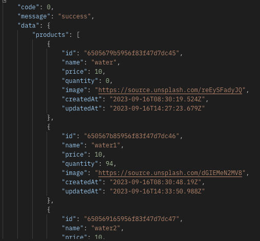

This is a [Next.js](https://nextjs.org/)

## Require System

```bash
Docker
go
```

## Getting Started

First, run the development server:

```bash
 docker-compose up -d
 go run main.go
```

Send [http://localhost:3001/api/v1/product](http://localhost:3001/api/v1/product) with to see the result.

When your runing backend completely. It sholud look like this


